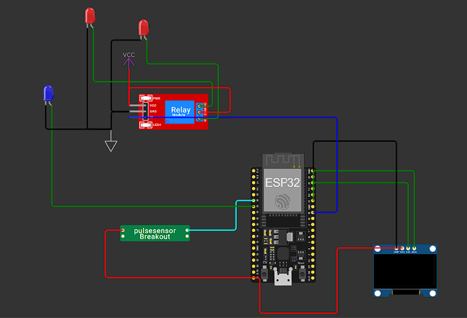
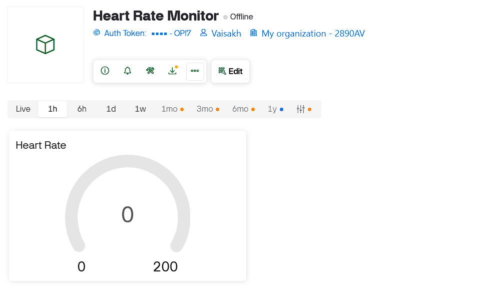

# ESP32 Heart Rate Monitor with Blynk IoT

A real-time heart rate monitoring system using ESP32, pulse sensor, OLED display, and Blynk IoT platform. Features automated alerts and cooling fan control based on heart rate thresholds.

## Features

- 📊 Real-time heart rate monitoring via pulse sensor
- 📱 IoT connectivity with Blynk app
- 🖥️ OLED display for local visualization
- 🚨 LED alerts for abnormal heart rates
- 🌀 Automated relay control (fan simulation) for high heart rate
- ⚡ Configurable min/max thresholds

## Hardware Components

| Component | Specification |
|-----------|---------------|
| Microcontroller | ESP32 |
| Display | SSD1306 OLED (128x64) |
| Sensor | Pulse Sensor |
| Actuator | Relay Module |
| Indicator | LED |
| Connectivity | WiFi |

## Pin Configuration

| Pin | Function |
|-----|----------|
| GPIO 35 | Pulse Sensor Input |
| GPIO 19 | Relay Control |
| GPIO 32 | Alert LED |
| GPIO 21 | OLED SDA |
| GPIO 22 | OLED SCL |

## Setup Instructions

1. **Hardware**: Connect components according to pin configuration
2. **Blynk**: Create template, add Device, update auth token in code
3. **WiFi**: Update SSID and password in sketch
4. **Upload**: Flash to ESP32 using Arduino IDE

## Blynk Dashboard

- **Virtual Pin V0**: Heart Rate display (0-200 bpm)

## Thresholds

- **Normal**: 50-120 bpm
- **Low Alert**: &lt; 50 bpm
- **High Alert**: &gt; 120 bpm (triggers relay + LED)

## Images
- ### Circuit
  
- ### Blynk Dashboard
  

## Simulation

[View on Wokwi](https://wokwi.com/projects/408299128629093377)

